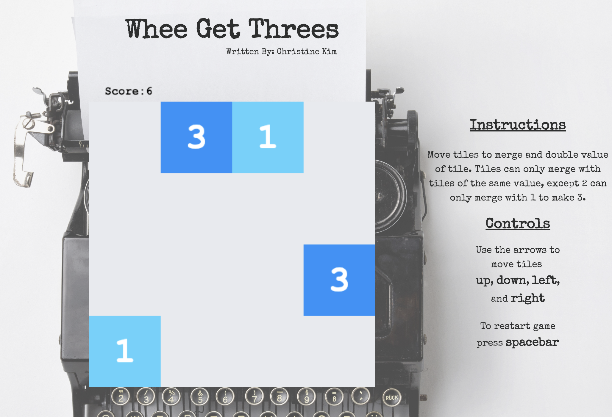

## Whee get Threes

[Live link](https://ckim310.github.io/whee-get-threes/)

### Overview

Whee get Threes is a play on the game Threes. The objective of the game is to slide the tiles on the grid and combine them with a tile of the same number (excluding a tile with 2, that can only be combined with a tile with 1) to create the highest possible multiple of three. The game will start with a random tile of 1, 2, or 3 in a random position.

Depending on which arrow key the user presses, all tiles will move one square in that said direction.

### Play

Users can move tiles using arrow keys and reset the board at any time using the space bar. Tiles will move in the direction of arrows clicked and will merge when near another tile of the same value (2s will only merge with 1s).

### Technologies

This project implemented the following technologies:

- `JavaScript` for creating the game, board, tile classes,
- `HTML` to structure the page layout,
- `CSS` to style the page and game (board and tiles).